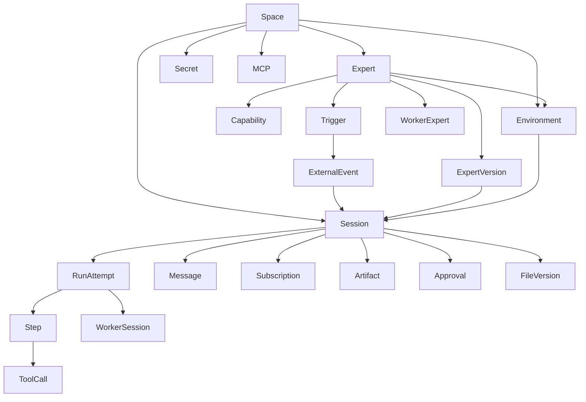

# Augment Cosmos 产品研究与 Relay 完整原型基线

> 研究日期：2026-07-12  
> 资料范围：Augment 官方 Cosmos 文档、官方 Blog、Changelog、Workflows 目录  
> 目的：理解 Cosmos 的真实产品模型，并据此建立 Relay 后续原型与工程实现基线

## 1. 执行结论

Augment Cosmos 不是一个“可以选择 Agent 的聊天后台”，也不是普通的 AI Workflow Builder。它更接近一个面向软件研发组织的 **Agentic SDLC 操作系统**：团队把专家能力、执行环境、外部工具、事件入口、共享记忆和人工判断固化成可复用系统，Agent 在后台持续执行，人只在目标、规格、风险和最终决策处介入。

Cosmos 的核心价值不是“模型能写代码”，而是解决以下组织级问题：

1. 每位工程师各自维护提示词和工具配置，经验无法复用。
2. Agent 只提升个人编码速度，却没有改善从需求、实现、测试、Review 到交付的整条链路。
3. Agent 产生更多代码后，Review、验证、风险判断和跨工具协调反而成为更严重的瓶颈。
4. 长任务缺少持续运行、恢复、事件唤醒、共享记忆和可审计外部写入能力。
5. 团队无法判断哪些 Agent 配置有效、成本如何、失败在哪里、应该如何改进。

因此 Cosmos 把产品重心放在五层能力上：

```text
团队边界      Spaces / Visibility / Permissions / Service Accounts
可复用配置    Experts / Environments / Capabilities / Skills
持续执行      Sessions / Turns / Tool Calls / Workers / Subagents
事件驱动      Automations / Triggers / Subscriptions / Event Log
持久资产      Files / Memory / Artifacts / Version History / Audit
```

Relay 的原型也必须围绕这些对象和关系构建。继续添加互不相干的 Dashboard、卡片或静态设置页，无法形成可用于后端设计的产品基线。

## 2. Cosmos 到底是什么产品

### 2.1 官方定位

官方将 Cosmos 定义为 “the operating system for agentic software development”。它允许 Agent：

- 在 Augment 云环境、开发 VM、笔记本或自托管基础设施上运行。
- 读取多个仓库、执行命令、调用 GitHub、Slack、Linear、PagerDuty、MCP 等工具。
- 由人工消息、GitHub/Slack/Linear 事件、Cron 或自定义 Webhook 启动。
- 在一个长期保存的 Session 中暂停、恢复、排队消息和等待后续事件。
- 通过 Worker、Subagent 或外部系统与其他 Expert 协作。
- 将文件、PR、分支、Issue、报告和团队知识跨 Session 持久化。

### 2.2 产品不是

- 不是 IDE 代码补全产品的 Web 版本。
- 不是只保存 Prompt 的 Agent Marketplace。
- 不是无状态的一次性聊天。
- 不是任意业务流程的低代码编排器。
- 不是完全无人监管的自动发布系统。

### 2.3 主要用户

| 用户 | 主要任务 | 产品价值 |
| --- | --- | --- |
| 开发者 | 把明确任务交给 Agent，异步跟进结果 | 减少上下文切换和重复执行 |
| Tech Lead / Reviewer | 聚焦架构、风险和产品判断 | 机械 Review、验证和跟进由 Expert 完成 |
| 平台工程团队 | 建立环境、工具、权限和标准专家 | 将个人 Agent 用法变成团队系统 |
| Engineering Manager | 管理吞吐、等待、失败和成本 | 从 Session 数据持续调优 Agent Fleet |
| SRE / 安全团队 | 诊断事件、控制高风险动作 | 隔离执行、审批、审计和可恢复运行 |

## 3. 核心领域模型

### 3.1 Space

Space 是团队或工作流的资源边界。切换 Space 会同时切换可见的 Sessions、Experts、Environments、Secrets、MCP Servers 和 Webhooks。Space 可设置默认 Expert 和默认 Environment。

Session 的 Space 按以下优先级确定：

1. Worker 继承 Manager Session 的 Space。
2. Expert 固定的 Space。
3. 用户启动时选择的 Space。
4. Daemon 声明的 Space。
5. 都没有时进入 Default Space。

### 3.2 Expert

Expert 是可复用的 Agent 配置蓝图，而不是运行中的 Agent，也不只是提示词。它至少包含：

- 身份、描述、可见性和稳定 ID。
- 系统指令、用户启动说明、输入 Placeholder。
- 默认模型和可管理模型策略。
- Capabilities、原生 Integrations 和 MCP Servers。
- Environment、仓库、运行资源和网络边界。
- 可调用的 Worker Experts。
- Triggers、Launch Guidance 和外部写入规则。

Template Expert 的核心 Prompt 由 Augment 管理，组织只追加自己的仓库和工作流配置；Custom Expert 完全可编辑。Expert 发布版本是不可变快照，历史 Session 固定引用对应版本。

### 3.3 Environment

Environment 是 Agent 真正执行代码和工具的机器配置：

- Cloud Environment：每个 Session 从可复现快照启动隔离 VM。
- Self-hosted Daemon：在用户自己的笔记本、VM、VPC 或专用机器运行。
- Daemon Pool：多个主机组成一个 Environment，Session 自动选择可用 Slot。

Cloud Environment 包含 Base Image、Repositories、非敏感环境变量、Hooks、网络和快照。更新只影响未来 Session，不静默改变现有 Session。

### 3.4 Session 与 Run

Session 是用户与某个 Expert 的长期对话和任务容器，保存所有 Message、Agent Turn 和 Tool Call。Session 永久保存，背后的 Environment 可以暂停、重启或从干净快照恢复。

Relay 在工程实现中必须把 Session 和 Run Attempt 分开：

- Session：目标、参与者、ExpertVersion、Space、可见性、消息、产物。
- Run Attempt：某次执行尝试的状态、步骤、环境实例、日志和失败原因。
- Retry：创建新的 Run Attempt，不能覆盖历史 Run。

### 3.5 Automation、Trigger 与 Subscription

Automation 是外部事件和 Expert 的持久绑定。

- Trigger 由人配置，命中后创建新 Session。
- Subscription 由 Agent 在运行时创建，命中后把消息送回原 Session。
- Scheduled Trigger 使用 Cron；前一次仍运行时跳过本次，不排队、不补跑。
- Trigger 支持 JSONLogic Filter、速率限制和自动归档。
- Event Log 保存所有入站事件和原始 Payload，Run History 展示触发后真正创建的 Sessions。

### 3.6 Worker、Subagent 与 Expert-to-Expert

| 模式 | 本质 | 运行环境 | 权限 | 适用场景 |
| --- | --- | --- | --- | --- |
| Worker | 独立 Expert Session | 独立 Environment/VM | 自己的完整权限 | 需要并行、外部写入或独立环境 |
| Subagent | 当前工作流中的轻量 Agent | 共享代码工作流 | 无独立 Cosmos 配置 | 仓库内研究、验证、局部实现 |
| Expert-to-Expert | 通过 PR/Slack/Issue 间接协作 | 各自独立 | 各自权限 | 可审计、松耦合事件协作 |

官方建议优先使用少量边界清晰的专用 Experts，避免复杂 Worker 编排。

### 3.7 Files、Skills 与 Memory

Files 是跨 Session 的虚拟文件系统：

- User Scope：用户私有。
- Organization Scope：组织共享。
- Workspace Scope：当前云 Session 的实时 VM 文件，仅在 Session 内出现。

每次写入产生不可变版本；删除保存 Tombstone；同步发生在 Agent Turn 边界。Skills 存储在 `.augment/skills/` 下，是 Files 支撑的特殊知识包。

### 3.8 Artifact

Artifact 是 Session 产生或关联的持久输出：

- Pull Request
- Git Branch
- Linear Issue
- Custom Link

Artifacts 出现在 Session 详情，并进入全局命令面板搜索。它们不是简单的文件列表，也不应与 Tool Call 混为一体。

### 3.9 Secrets、MCP 与 Integrations

- Integrations：GitHub、Slack、Linear、GitLab、PagerDuty 等平台托管连接，既可作为 Tool，也可作为 Trigger Source。
- MCP Registry：管理数据库、浏览器、监控、Figma、Stripe 等扩展工具，并固定到具体 Expert。
- Secrets：值只写不可读，按 Private/Shared/Space 范围注入 VM；日志必须脱敏。

## 4. 对象关系



## 5. 关键产品闭环

### 5.1 手动任务

```text
选择 Space
→ 选择 Expert（或使用 Space 默认）
→ 输入目标和附件
→ 选择/继承 Environment
→ 权限与连接预检
→ 创建 Session 并固定 ExpertVersion
→ Agent 执行多个 Turn
→ 人工输入或审批
→ 生成 Artifact
→ Session 保存并可继续对话
```

### 5.2 自动化任务

```text
外部事件
→ Event Log 持久化
→ JSONLogic / Header Filter
→ Rate Limit / Singleton 检查
→ Trigger 命中 Expert
→ 以 Service Account 创建 Session
→ Agent 执行或创建 Worker
→ 回写外部系统
→ 自动归档或保留 Session
```

### 5.3 持续学习

```text
Session 结果与人工反馈
→ Expert/Memory Manager 提炼
→ Organization Files / Skills
→ 后续 Expert Session 加载
→ Advisor 从失败、等待和成本模式中提出调优建议
```

## 6. Cosmos 的体验原则

### 6.1 对话优先，而不是表单优先

最新官方文档持续建议使用 Cosmos Advisor 配置 Integrations、Environments、Experts 和 Automations。传统表单仍然存在，但 Advisor 是首选入口。Relay 应同时保留：

- 面向熟练管理员的结构化配置页。
- 面向普通团队成员的 Advisor 对话式设置路径。
- 所有 Advisor 建议都必须先展示计划并由用户确认，不能直接产生外部副作用。

### 6.2 Session 是第一产品表面

Home、Sidebar、Cmd+K、Recent/Pinned Sessions、Artifacts 搜索都围绕 Session。Run History 是 Automation 的运营视图，不应与 Session 作为同级重复主对象。

### 6.3 人类负责判断，而不是逐步操作

官方产品叙事把传统八次人工中断压缩为三类 Checkpoint：

1. Prioritization / Goal
2. Spec / Intent / Risk
3. Final decision / Rollout

原型中的审批也必须展示“为什么现在需要人”，而不是只有一个批准按钮。

### 6.4 安静、高密度、可扫描

从官方 Workflows、Docs 和公开截图可归纳出以下视觉特征：

- 中性黑白/灰色基础，绿色只用于活动或确认。
- 小圆角、细边界、线性图标、低装饰。
- 信息通过行、分隔线、分组导航组织，不堆叠大型 Dashboard 卡片。
- 等宽字体用于 ID、版本、事件类型、时间和代码类信息。
- 支持 Dark / Light / System，并保持相同层级关系。

## 7. Relay 当前原型差距

| 能力 | 当前状态 | 结论 |
| --- | --- | --- |
| Sessions | 列表管理与单次运行工作台较完整 | 需要拆分 Session / Run Attempt |
| Experts | 已支持创建、编辑、发布、停用、版本与回滚 | 当前最完整模块 |
| Approvals | 仅 Run 内单条模拟审批 | 缺独立收件箱和状态机 |
| Automations | 静态列表 | 缺 Trigger、Event Log、Run History 闭环 |
| Environments / Daemons | 缺失 | 无法表达 Agent 在哪里运行 |
| Files / Memory / Skills | 缺失 | 无跨 Session 持久上下文 |
| Artifacts | 只散落在 Mock 文本 | 缺正式实体和搜索 |
| Integrations / MCP / Webhooks / Secrets | 大多静态或缺失 | 配置控制面不完整 |
| Spaces | 缺失 | 多团队与默认资源无边界 |
| Advisor | 缺失 | 与官方最新首选设置路径差距大 |
| 全局命令面板 | 缺失 | Session 与 Artifact 可发现性不足 |

## 8. Relay 完整原型信息架构

```text
Relay / Space Picker
├── Home
├── New Session
├── Sessions
├── Files
│   ├── Organization
│   └── User
├── Approvals
├── Automations
│   ├── Overview
│   ├── Event Log
│   └── Run History
├── Configuration
│   ├── Experts
│   ├── Environments
│   ├── Daemons
│   ├── Repositories
│   ├── Integrations
│   ├── MCP Registry
│   ├── Webhooks
│   └── Secrets
└── Administration
    ├── Spaces
    └── Settings
```

旧 `/runs` 仅作为兼容路由存在，正式产品中 Run History 归入 Automations；Session 内展示自己的多个 Run Attempts。

## 9. 完整原型必须可验证的交互

### P0 闭环

1. 发布 Expert → 创建 Session → 执行 → 进入审批 → 批准 → 生成 PR Artifact。
2. 创建/启用 Automation → 注入示例事件 → Event Log 命中 → 自动创建 Session → Run History 可追踪。
3. Run 失败 → 查看失败原因 → Retry 创建新 Attempt → 成功，旧 Attempt 保留。
4. Space 切换 → Sessions、Experts、Environments、Secrets、MCP 列表同步变化。
5. Environment 创建向导 → Provisioning → Ready → 可被 Expert 选择。

### P1 控制面

- Integrations Connect/Test/Disconnect。
- MCP Add/Configure/Enable/Attach。
- Webhook Create/Reveal Once/Test/Disable。
- Secret Add/Rotate/Delete，值永不回显。
- Files Scope 切换、预览、版本查看和路径复制。
- Cmd+K 搜索 Sessions、Experts、Artifacts 和配置资源。
- Advisor Setup Plan：依赖 → Environment → Expert → Automation，每步需确认。

### 原型明确模拟的部分

- OAuth、真实 GitHub/Slack/Linear API。
- VM/Container Provisioning 和 Daemon 连接。
- LLM 推理、流式 Tool Call 和真实成本。
- 外部 Webhook 接收与 JSONLogic 执行服务。
- Secret 加密、RBAC、对象级权限和审计后端。

这些部分必须在 UI 中标注为 Simulation / Prototype，而不能伪装成真实后端结果。

## 10. 后端复杂度判断

### 官方明确公开

- Agent Runtime、Context Engine、Event Bus、Organizational Knowledge Layer。
- Cloud VM、自托管 Daemon、Daemon Pool 和 Session 恢复。
- Expert Registry、Files/Memory、Integrations、Human-in-the-Loop。
- Trigger、Subscription、Webhook、JSONLogic、Run History 和 Event Log。
- Spaces、Secrets、MCP、Service Account、成本与版本历史。

### 合理工程推断

完整产品需要：

- 多租户身份、Space/RBAC/OLAC 和服务账号。
- Session/Run 持久状态机、实时事件流和消息排队。
- Event Bus、调度、幂等、速率限制和 Cron Singleton。
- VM/Container/Daemon 生命周期、快照、Keepalive、恢复和并发调度。
- Tool Broker、OAuth、MCP 生命周期和凭据隔离。
- 文件版本、Artifact、对话、日志、审计和检索存储。
- Token、计算资源和成本计量。

官方没有公开具体数据库、消息队列、编排器或服务端语言，Relay 不应在产品原型阶段假设必须使用某个具体基础设施。

## 11. 官方资料

- [Getting Started with Cosmos](https://docs.augmentcode.com/cosmos/getting-started.md)
- [Using Sessions](https://docs.augmentcode.com/cosmos/sessions-overview.md)
- [Experts](https://docs.augmentcode.com/cosmos/experts.md)
- [Template Experts](https://docs.augmentcode.com/cosmos/experts-templates.md)
- [Configure a Custom Expert](https://docs.augmentcode.com/cosmos/experts-configure-custom.md)
- [Delegating Work](https://docs.augmentcode.com/cosmos/workers-subagents.md)
- [Cosmos Environments](https://docs.augmentcode.com/cosmos/environments/overview.md)
- [Cloud Environments](https://docs.augmentcode.com/cosmos/environments/cloud.md)
- [Self-hosted Environments](https://docs.augmentcode.com/cosmos/environments/daemons.md)
- [Understanding Automation](https://docs.augmentcode.com/cosmos/automations.md)
- [Managing Automations](https://docs.augmentcode.com/cosmos/manage-automations.md)
- [Configuring Triggers](https://docs.augmentcode.com/cosmos/config-triggers.md)
- [Webhooks](https://docs.augmentcode.com/cosmos/config-webhooks.md)
- [Understanding Files](https://docs.augmentcode.com/cosmos/understanding-files.md)
- [Understanding Artifacts](https://docs.augmentcode.com/cosmos/artifacts.md)
- [MCP Registry](https://docs.augmentcode.com/cosmos/config-mcp.md)
- [Managing Secrets](https://docs.augmentcode.com/cosmos/config-secrets.md)
- [Cosmos Spaces](https://docs.augmentcode.com/cosmos/spaces/overview.md)
- [Managing Spaces](https://docs.augmentcode.com/cosmos/spaces/managing.md)
- [Cosmos Advisor](https://docs.augmentcode.com/cosmos/advisor/overview.md)
- [Cosmos Public Preview](https://www.augmentcode.com/blog/cosmos-now-in-public-preview)
- [Cosmos Week 28 Release Notes](https://www.augmentcode.com/changelog/cosmos-week-28-release-notes)
- [Agent Workflows](https://www.augmentcode.com/workflows)
