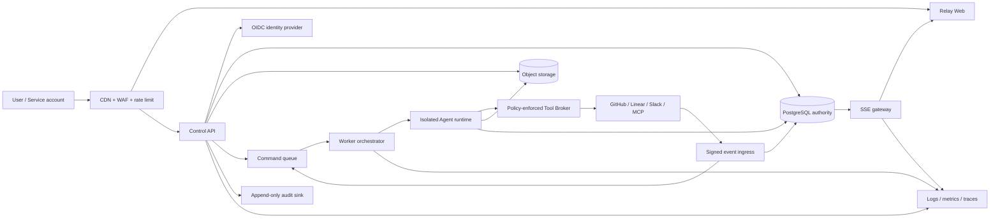

# Relay 生产架构基线

> 文档状态：Target architecture，不是当前已实现声明
> 版本：1.1
> 日期：2026-07-13
> 上游：[产品需求](./product-requirements.md)、[后端需求](./backend-requirements.md)、[API 契约](./api-contract.yaml)
> 配套：[数据模型、权限与 Session 生命周期](./data-model-permissions-session-lifecycle.md)

## 1. 目的与声明边界

本文定义 Relay 处理真实客户数据时的系统边界、信任边界、容灾目标和发布门槛。它不用于证明架构已经落地；实施状态必须由代码、部署和可复现验证证明。

本文使用四种来源：

| 来源 | 使用方式 |
| --- | --- |
| **Official** | 仅引用 [Cosmos 官方证据矩阵](./cosmos-evidence-matrix.md) 中已核验的产品对象与行为 |
| **Inferred** | 从官方行为推导的界面或技术选择，不声称是 Cosmos 内部架构 |
| **Relay target** | Relay 为安全、可靠性、治理和商业交付定义的架构约束 |
| **Current** | 2026-07-13 当前仓库中可指向代码/测试的实现 |

Cosmos 官方资料证明 Expert、Environment、Session、Automation、Files 等产品概念，不证明本文中的 PostgreSQL、队列、对象存储、RLS 或部署拓扑是 Augment 的内部实现。

## 2. 当前纵向切片

| 层 | **Current** | 生产判定 |
| --- | --- | --- |
| Web | React/Vite；Session list/create/detail/start/send 与 Expert/Environment 只读 Catalog 调用 API；能力发现控制启动和后续消息；生产工作台轮询 canonical Message/Event 并投影 running/retry/failure/completion，成功发送后立即合并权威 Message；scope、凭据轮换或 401/403/404 会清除旧私密投影；demo 单独保留完整原型 | 基础对话状态可作为服务端事实；Tool、Files、Terminal、Changes 和 Approval 仍是未服务化范围 |
| Contract | `@relay/contracts` 对 capabilities、Session create/list/get、Message/Event timeline、Attempt/Session 事件、authoritative revision IDs、Expert/Environment summary/detail 和分页响应提供 Zod 运行时验证 | OpenAPI 与运行契约已覆盖当前表面，但尚未由同一源生成 |
| API | Fastify；health/ready；`/me` identity discovery；capabilities；完整 Session metadata/execution controls；ShareGrant；Message/Event 与可恢复 SSE；Expert/Environment list/get；OIDC；Organization/Space membership；ServiceAccount exact create/send/archive policy | 无 Catalog 写 API、合规访问、限流和完整拒绝/失败审计，不可公网暴露 |
| Data | PostgreSQL immutable revision、Session/Turn/Command/Attempt/Message/Event/ShareGrant/Artifact/ServiceAccount binding；复合 tenant FK；actor/路径级幂等；25 张租户表 FORCE RLS；API/Worker 分离的受限角色与 transaction-local tenant context；账本禁止 UPDATE/DELETE | 无 ExecutionSnapshot 和完整领域实体；retention、生产备份恢复与规模迁移证据尚未实现 |
| Execution | PostgreSQL protocol-1 consumer 使用并发 claim、数据库权威 lease/heartbeat/fencing、有限重试、过期恢复和撤权取消；Worker 另写进程就绪心跳，`capabilities` 与新 `start=true` 只在心跳新鲜时开放；OpenAI-compatible provider 只生成有界对话输出；SSE/轮询暴露 allowlist 事件 | 无 coding sandbox、Tool Broker、外部副作用 ledger、Artifact/File runtime、dead-letter 运维闭环与负载/soak 证据 |
| Operations | PostgreSQL 17 CI service；required workflow 运行 unit/build、非 skip integration、OpenAPI、Secret/whitespace scan、production migration 与 API/Web image/runtime/proxy smoke；本地 compose 只绑定 loopback；API/Worker/Web 有非 root 多阶段镜像与健康检查；API read-only readiness 与 Worker execution readiness 分离；API SQL 超时有界，Web 同源 `/api` upstream 与 CSP origin 通过运行时变量注入 | 无环境 IaC、镜像签名/SBOM、backup/restore、staging/canary/rollback、SLO、on-call 和故障演练 |

现阶段的准确名称是“权威 Session、只读 Catalog 与基础对话执行纵向切片”，不是完整 Agent 平台或生产就绪。

## 3. 目标系统上下文

该图全部是 **Relay target**。各实施可同进程起步，但不可合并信任责任：API 不能绕过 Tool Policy 执行外部写，Agent runtime 不能直接给自己提权，投影/搜索不能取代 PostgreSQL 权威数据。

## 4. 组件责任

| 组件 | 唯一责任 | 不得承担 |
| --- | --- | --- |
| Edge | TLS、WAF、粗粒度限流、路由、静态资源 | 领域授权或信任客户端 tenant header |
| Web | 交互、表单、本地偏好、服务端投影 | 最终权限、Secret 存储、领域状态权威 |
| Control API | 身份上下文、授权、验证、事务、命令接受 | 长时间 Agent 执行或无边输出 |
| PostgreSQL | 领域事实、状态机、sequence、outbox、幂等、tenant guard | 大附件和无上限 Tool output |
| Object storage | 附件、FileVersion 内容、大输出和快照 | 单独判定授权；访问必须由 API 签发短期 URL |
| Command queue | 持久命令交付、背压与租约 | 作为领域唯一事实源 |
| Orchestrator | 调度、lease/heartbeat、重试、恢复、资源配额 | 改写授权快照或静默重放外部副作用 |
| Agent runtime | 模型回合、工作区、Worker、ToolCall 请求 | 长期 Secret 保存或绕过 Tool Broker |
| Tool Broker | 服务端策略、参数约束、凭据取用、幂等副作用、脱敏 | 接受模型声称的权限 |
| SSE gateway | 授权后的有序事件交付与恢复 | 发送 Secret、完整大输出或隐藏推理 |

## 5. 关键事务与时序

### 5.1 创建并启动 Session

1. Edge 完成基础防护，API 验证 access token，建立 actor/organization/space context。
2. Authorization service 检查 `session.create`、Expert 可见性、Environment 可用性和 advanced override policy。
3. 服务端解析并固定 Published ExpertRevision 和 Ready EnvironmentRevision；客户端名称/版本不作权威值。
4. 同一 PostgreSQL 事务写入 Session、first Message、Turn、Command、OutboxEvent、SessionEvent 和完整幂等响应。
5. API 返回 201；命令已接受不等于 Agent 已执行。Outbox relay 将 Command 交付给队列。
6. 相同 actor/path/key/body 重放返回原 status/body/headers；不同 body 返回 `IDEMPOTENCY_KEY_REUSED`。

### 5.2 执行 Turn

1. Worker 获取有期租约，在 quota 和 policy 下启动隔离 runtime。
2. 每次 Attempt 使用固定执行快照；心跳和状态更新产生递增 Session sequence。
3. ToolCall 在执行时重新授权；高风险调用等待 Approval，且批准绑定精确参数 hash。
4. 外部写使用 provider idempotency key 或 Relay side-effect ledger；租约丢失时不盲目重放未知结果。
5. 终态事件、Artifact/FileVersion 元数据和 AuditEvent 持久化后再释放运行资源。

### 5.3 自动化事件

1. Ingress 在原始 body 上验证签名、timestamp 窗口和 body limit，再解析内容。
2. `(organization, source, externalId)` 去重，原事件和脱敏摘要分开保留。
3. Trigger match 产生可解释结果；命中时调用与手动启动相同的 Session transaction。
4. Subscription 只把事件投递给已有 Session，不新建 Automation 写模型或第二套 Session 语义。

## 6. 信任与数据边界

- 所有领域 API 默认鉴权；health/liveness 是唯一可公开例外，readiness 只向编排器网络开放。
- 不信任 `organizationId`、`spaceId`、`actorId`、role、Expert/Environment revision 或可见性等客户端 body/header 声明。
- Authorization 在 API 入口执行，PostgreSQL 再用 RLS 或统一 tenant guard 防止查询漏加 scope；两层不互相替代。
- 应用日志、trace、metrics 和 AuditEvent 默认不含 prompt、Secret、OAuth token、附件内容、File 内容或原始外部 payload。
- 对象存储 key 不使用客户文件名；下载 URL 最长 5 分钟，撤权/删除后不再签发。
- 生产 Secret 来自专用 Secret Manager/KMS，不来自数据库明文、前端、镜像或仓库 `.env`。

## 7. 可靠性和 SLO（Relay 初始目标）

下表是 **Relay target**，不是当前测量结果。设计合作伙伴阶段可收集基线并调整，但降低目标需要产品、工程和安全共同记录决策。

| ID | 指标 | 初始目标 |
| --- | --- | --- |
| SLO-01 | 控制面月可用性 | >= 99.9%，排除公告的计划维护 |
| SLO-02 | 已缓存 GET 延迟 | p95 <= 300 ms，p99 <= 800 ms，不含客户网络 |
| SLO-03 | 命令接受延迟 | p95 <= 500 ms，p99 <= 1.5 s，不含 Agent 执行 |
| SLO-04 | 持久性 | API 已确认的 Message/Command 丢失数 = 0 |
| SLO-05 | 幂等正确性 | 合法重试产生的重复 Session/Turn/已记录外部副作用 = 0 |
| SLO-06 | SSE 恢复 | 有效 `Last-Event-ID` 重连 p95 <= 5 s，序列 gap = 0 |
| SLO-07 | tenant isolation | 跨 Organization/Space 未授权读写 = 0；任一事例触发最高级事故 |
| SLO-08 | 审计 | 定义的高风险动作 AuditEvent 覆盖率 = 100% |
| SLO-09 | 灾备 | PostgreSQL RPO <= 5 min，服务 RTO <= 60 min；每季度恢复演练 |
| SLO-10 | 告警 | 用户影响型 P1 事故 5 分钟内告警，15 分钟内有人响应 |

容量边界不凭空填写。GA 前必须在目标客户数量、Session 数、并发 Turn、事件速率、附件大小和 SSE 连接数下运行 load + soak，再把实测安全边界写入运维手册。

## 8. 可观测性和运维

每个 HTTP request、Command、Turn、Attempt、ToolCall 和 provider call 传播 `traceparent`、`requestId`、`organizationId` 的不可逆 hash 与资源 ID；高基数 ID 不作 metrics label。

发布前至少具备：

- API、DB pool、queue depth/age、worker lease、SSE reconnect、provider error、outbox lag、audit write 和 object scan 的 dashboard/告警。
- 数据库不可达、queue 积压、worker 全部失联、IdP 中断、provider 限流、对象存储故障和密钥轮换的 Runbook。
- 部署、回滚、数据库迁移、备份恢复、数据删除、安全事故和客户沟通的 owner 与升级路径。
- 按 release/version 分组的错误率和核心旅程指标：Session 启动成功率、time-to-first-agent-action、完成率、Artifact 产生率、人工介入率和重试率。

## 9. 部署与发布策略

1. 环境分为 local、test、staging、production；production 数据不复制到低环境，fixture 使用合成数据。
2. 镜像使用 digest 部署，生成 SBOM 和签名；CI 执行 lint、typecheck、unit、contract、integration、migration、SAST、dependency/container scan 和 build provenance。
3. 数据库变更使用 expand -> backfill -> switch -> contract；应用必须先兼容新旧 schema，不在同一部署中执行不可回滚删列。
4. 先部署 staging 并运行 smoke/contract/E2E，再 canary 5% -> 25% -> 100%；每段观察 SLO 和业务正确性。
5. 功能旗标不作为权限控制；旗标有 owner、过期日期、回滚路径和租户范围。
6. 回滚应用不等于回滚数据；数据损坏使用 forward repair/PITR 和已审批 Runbook。

## 10. GA Go/No-Go

下列任一项缺失即 No-Go：

- 存在未鉴权的领域 API，或跨 tenant/Private Session 负向测试未通过。
- 生产仍可使用内存 repository，或 PostgreSQL backup/restore 未演练。
- Session 创建不能原子产生 Message/Turn/Command/Outbox，或幂等测试可产生重复副作用。
- OpenAPI、共享 contract 和实际 HTTP 响应存在未批准漂移。
- 模拟控制面/执行结果在生产中没有禁用或显著 Simulation 标记。
- 无脱敏 AuditEvent、威胁模型、渗透报告、依赖/镜像扫描或 Secret 轮换证据。
- SLO 无 dashboard/alert/error budget，或值班人员无 Runbook 和事故升级路径。
- 负载/soak、容灾、迁移、可访问性、Light/Dark、中/英和关键 E2E 未完成签署。

## 11. 待决策 ADR

| ADR | 问题 | 默认方向 | 退出条件 |
| --- | --- | --- | --- |
| ADR-001 | Queue 与 lease 实现 | 先使用 PostgreSQL Command/Outbox + `SKIP LOCKED`，保留 broker adapter | 实测队列延迟/吞吐/运维不达 SLO 时引入专用 broker |
| ADR-002 | Tenant database isolation | 共享 schema + 强制 RLS/tenant guard | 合规或大客户需求独立 database/account |
| ADR-003 | Identity provider | OIDC 标准接口，第一家 provider 尚待商业决策 | SSO/SCIM/区域/数据处理要求确定 |
| ADR-004 | OpenAPI 代码生成 | OpenAPI 作唯一源，生成 TS/Zod 或自动差异校验 | PoC 选择能保留 Zod 运行时验证且 CI 稳定的工具链 |
| ADR-005 | Search | PostgreSQL FTS/trigram 起步，搜索仅作授权后投影 | Artifact/消息体量与相关性实测需要外部索引 |

每个 ADR 必须记录 owner、日期、备选方案、安全/成本/运维影响和反转条件；未决策项不能在代码中以隐式方式固化。
